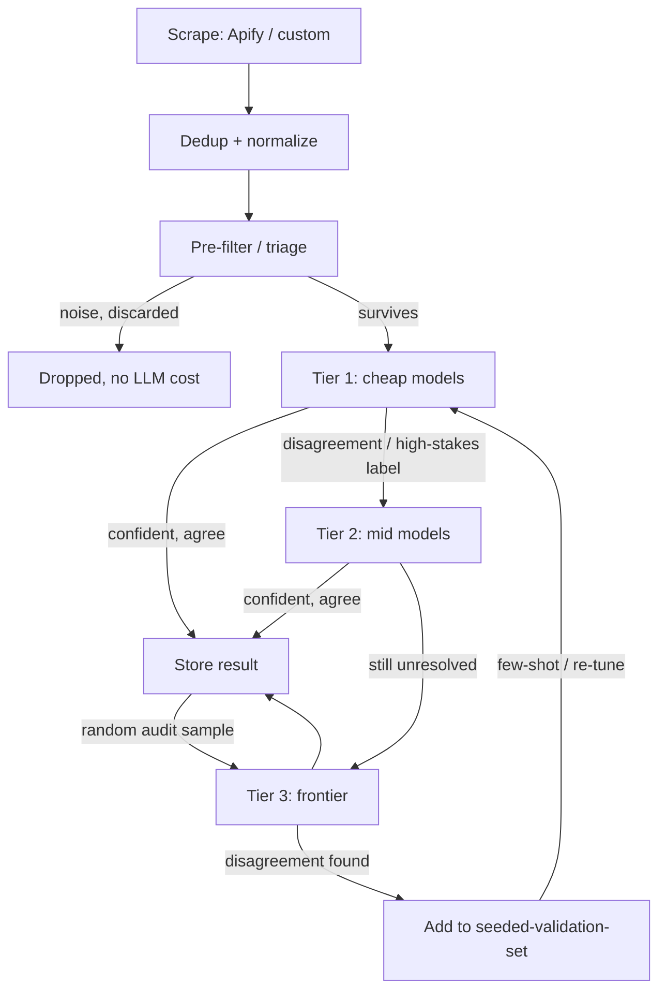

# Scale Workflow: From Prototype to Enterprise-Scale Classification

Target architecture for taking Project Jupiter from "point `parallel_classifier.py` at a
few seed events" to "classify ~1M articles/day at bounded cost." This is a design doc, not
a build order — nothing here is implemented yet. See "Suggested build order" at the bottom
for what to actually build first when the time comes.

The core idea: **don't run every article through every model.** Run everything through the
cheapest model first, and only pay for expensive models on the fraction of events that
actually need them. This is a routing/cascade pattern, not a bigger version of the current
single-model script.

---

## 0. Where we are vs. where this is going

| | Now | Target |
|---|---|---|
| Volume | 5–30 seed events | ~1M articles/day |
| Models per event | 1 (whatever `--model` you pass) | cascade: tier1 → tier2 → tier3, most events stop at tier1 |
| Input source | hand-curated JSONL | continuous scrape (Apify/custom) |
| Storage | flat JSONL + manifest sidecar | JSONL as write-ahead log, batch-loaded into a DB for querying |
| Cost visibility | per-run estimate | running ledger across all runs, $/1000 classified |
| Accuracy check | one seeded-validation-set run | continuous audit sampling against a growing validation set |

Everything in the "Now" column already exists in `scripts/parallel_classifier.py` and
`scripts/analyze_results.py` — the target builds on top of it, it doesn't replace it.

---

## 1. Ingestion layer

- Scrape via Apify (or a custom scraper) across whatever sources matter for the domain.
- Dedup before anything else touches an LLM: URL hash for exact dupes, embedding
  similarity for near-dupes (same story syndicated across outlets).
- Normalize every article into the event schema the classifier already expects
  (`event_id`, `target_entity`, description, date, source URL, optional `domain_context`).
- Land raw scraped output in its own store, decoupled from the classify step. Scraping
  and classifying should be able to run on different schedules — you don't want a slow
  model run blocking the next scrape, or vice versa.

## 2. Pre-filter / triage (no LLM calls yet)

Most of "1M articles" is noise relative to any given target entity or domain. Cut volume
here, before spending a single token:

- Keyword/entity filters (does this even mention the target entity or domain?)
- Date filters (already required — post-cutoff sourcing per
  [experiment-flags.md](experiment-flags.md) Flag 5)
- Cheap classifier or even regex-based "is this even news about a shock-shaped event"
  triage, if the source is noisy enough to warrant it

This step alone is often the biggest cost lever at 1M scale — it's free (no API calls)
and can plausibly cut volume by an order of magnitude before the cascade even starts.

## 3. Cascade classification

**Stage A — Tier 1 (cheap/small models).** Every event that survives triage goes through
one or more Tier 1 models (see [model-list.md](model-list.md)) at high concurrency, since
these are cheap and fast per Flag 7's worker limits.

**Confidence / escalation signal.** This is the piece that doesn't exist yet and is the
actual design problem to solve. Options, roughly cheapest to most rigorous:
- Self-consistency: run the same Tier 1 model 2–3 times (or 2 different Tier 1 models)
  and escalate on disagreement.
- Rule-based: escalate anything classified as Black Swan/Gray Rhino (the "interesting"
  labels) regardless of confidence, since false negatives on rare classes matter more
  than false positives on "Neither."
- Model self-reported confidence, if the schema is extended with a confidence field —
  weakest signal (models are often overconfident) but cheapest to add.

Start with rule-based + self-consistency; a learned confidence model is a later-stage
optimization once there's enough labeled disagreement data to train one.

**Stage B — Tier 2 (mid models).** Only the escalated subset (should be a small fraction
if triage + Tier 1 are doing their job) goes through Tier 2. Same escalation logic applies
on top: disagreement or high-stakes label → escalate again.

**Stage C — Tier 3 (frontier).** Ground-truth tier. Gets: (a) whatever's left unresolved
after Stage B, and (b) a random audit sample of Stage A/B "confident" output (see below) —
not because those are expected to be wrong, but to catch silent drift.

## 4. Audit loop / false-positive tracking

- Periodically sample N% of each tier's "confident, not escalated" output and run it
  through Tier 3 or manual review. Compare agreement rate.
- Track this over time, not just once — a model's effective accuracy can drift as event
  distributions shift (new topics, new phrasing) even if nothing about the model changed.
- Every disagreement found this way is a candidate to add to
  `data/input/seeded-validation-set.jsonl` (per Flag 9 — keep it separate from whatever
  blind set is being scored), growing the validation set organically instead of needing a
  separate manual-labeling effort.
- This is also where the false-positive count the earlier tools.txt notes asked about
  actually gets measured, continuously, instead of as a one-off check.

## 5. Cost & ops tracking

`analyze_results.py` already prints a per-run cost estimate and `parallel_classifier.py`
already writes a manifest per run. At this scale, that needs to become a **ledger across
runs**, not per-run only:
- Total spend and $/1000 classified, broken down by tier
- What fraction of events got escalated past Tier 1 (the number to watch — if this creeps
  up, either the event distribution changed or Tier 1 needs re-tuning)
- Rate-limit hits per model/provider (Flag 7), so the bottleneck provider is visible at a
  glance instead of buried in per-run logs

## 6. Storage & analysis

JSONL + checkpoint/resume stays as the write-ahead format for a single run — no reason to
change what already works for crash recovery. But at 1M+ rows, querying "show me every
Gray Rhino classification for target entity X in the last 30 days" against flat files
doesn't scale. Batch-load completed run output into a real database (Postgres, or DuckDB
if you want to stay filesystem-based) and let `analyze_results.py`-style queries run
against that instead of re-parsing JSONL every time.

## 7. Feedback loop — the actual cost lever

The escalation fraction from step 3 is the number that determines whether 1M articles/day
is affordable. The way it goes down over time: every audit disagreement (step 4) that gets
resolved becomes a labeled example; feed accumulated examples back into Tier 1's prompt as
few-shot examples (or eventually a fine-tune) so Tier 1 gets better at the cases it used to
have to escalate. Scale here isn't "throw more workers at it" — it's "make the cheap tier
resolve more on its own so fewer events ever need the expensive tiers."

---

## Pipeline diagram

---

## What's already built vs. what's new

**Already have** (in `scripts/parallel_classifier.py` / `analyze_results.py`): model
tiers, checkpoint/resume, per-run manifest, per-run cost estimate, domain context
injection, structured-output fallback chain, ground-truth scoring against a seeded set.

**New pieces this workflow needs**: pre-filter/triage stage, confidence/escalation router
between tiers, audit-sampling loop, cross-run cost ledger, DB-backed storage for querying
at volume, few-shot feedback loop from audit disagreements back into Tier 1.

## Suggested build order (when ready — not now)

1. Escalation router on top of the current script — biggest accuracy/cost lever, smallest
   engineering lift, and testable on the existing seed data before any scraping exists.
2. Pre-filter/triage stage — cuts cost before the cascade matters at all.
3. Cross-run cost ledger — cheap to add, makes every later decision measurable.
4. DB-backed storage — only needed once run volume actually stresses flat-file querying.
5. Ingestion/scraping automation — last, since everything upstream should be validated on
   existing seed/manual data first rather than debugging scraping and classification
   accuracy at the same time.
